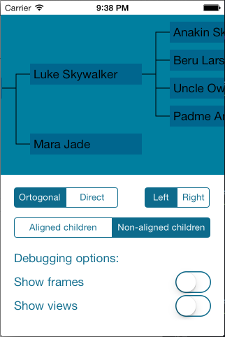
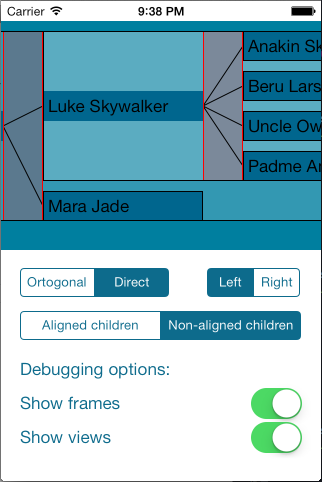

JENTreeView
===========
This is a simple treeview that creates and layout a treeview recursivly. 

# Usage

## Node Tree
Create a Node class that uses the JENTreeViewModelNode protocol: 

    @interface Node : NSObject<JENTreeViewModelNode>
        @required
        @property (nonatomic, strong) NSSet *children; // nodes
        @property (nonatomic, strong) NSString *name;
    @end  

Then build your tree of these objects like this: 

    Node *leaf1 = [[Node alloc] init];
    leaf1.name = @"Leaf label 1";
    
    Node *leaf2 = [[Node alloc] init];
    leaf2.name = @"Leaf label 2";
    
    Node *root = [[Node alloc] init];
    root.name = @"Root label";
    root.children = [NSSet setWithObjects:leaf1, leaf2, nil];

## Tree View
Create a treeView as you usally create a UIScrollView. 

    JENTreeView *treeView = [[JENTreeView alloc] init...];

Set the rootNode to the root of your Node tree:

    treeView.rootNode = root;

Then change the following properites as you like: 

    BOOL invertedLayout; // If the root node should be to the left or to the right
    BOOL alignChildren; // If the children should be aligned or not, X-axis
    CGFloat parentChildSpacing; // The space between the parent and it's closest child, Y-axis
    CGFloat siblingSpacing; // The space between the children
    
    BOOL showSubviews; // If you want a white tint on the subviews 
    BOOL showSubviewFrames; // If you want a black frame around the subviews
    
## Customization

If you want to create your own views, please set the dataSource:

    treeView.dataSource = self;
    
This allows you to implement your own NodeView and DecorationView, by implementing the following two methods: 

    -(UIView*)treeView:(JENTreeView*)treeView
    nodeViewForModelNode:(id<JENTreeViewModelNode>)modelNode;

    -(UIView<JENDecorationView>*)treeView:(JENTreeView*)treeView
    decorationViewForModelNode:(id<JENTreeViewModelNode>)modelNode;
    
The DecorationView should follow the following protocol: 

    @protocol JENDecorationView
        @required
        @property (nonatomic, assign) BOOL invertedLayout;
        @property (nonatomic, assign) CGFloat parentChildSpacing;
    @end
    
## Updating data

When you add something to your nodeTree, please call the following method afterwards:

    [treeView reloadData];
    
And when you update something visual like the child-parent-spacing, call:

    [treeView layoutGraph];
    
# Example

# ToDo's
* Make it easier to create your own customized Node views that can have a dynamic size. 
* Make it easier to create your own customized deocration views. 
* Fix the Example so that it work for iPad etc. 
