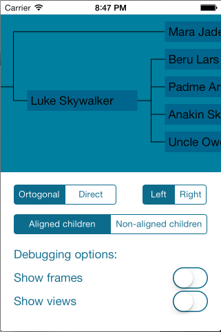

JENTreeView
===========
This is a simple treeview that creates and layout a treeview recursivly. 

#Usage

##Node Tree
Create a Node class that uses the JENTreeViewModelNode protocol: 

    @interface Node : NSObject<JENTreeViewModelNode>
    
        @property (nonatomic, strong) NSSet *children; // nodes
        @property (nonatomic, strong) NSString *name;

    @end  

Then build your tree of these objects like this: 

    Node *leaf1 = [[Node alloc] init];
    leaf1.name = @"Leaf label 1";
    
    Node *leaf2 = [[Node alloc] init];
    leaf2.name = @"Leaf label 2";
    
    Node *root = [[Node alloc] init];
    root.name = @"Root label";
    root.children = [NSSet setWithObjects:leaf1, leaf2, nil];

##Tree View
Create a treeView as you usally create a UIScrollView. 

    JENTreeView *treeView = [[JENTreeView alloc] init...];

Set the rootNode to the root of your Node tree:

    treeView.rootNode = root;

Then change the following properites as you like: 

    BOOL invertedLayout; // If the root node should be to the left or to the right
    BOOL alignChildren; // If the children should be aligned or not
    BOOL ortogonalConnection; // There's either direct or ortogonal connections
    
    CGFloat parentChildSpacing; // The space between the parent and it's closest child
    CGFloat siblingSpacing; // The space between the children
    
    UIColor *nodeBackgroundColor; // The view that is the "Node"
    UIColor *decorationLineColor;
    
    BOOL showSubviews; // If you want a white tint on the subviews 
    BOOL showSubviewFrames; // If you want a black frame around the subviews
    BOOL showDecorationViewFrames; // If you want a red tint on the decoration views (the view that holdes the connection-line)
    BOOL showDecorationViews; // If you want a red border around the decoration views
    
#Example

